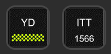
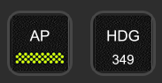
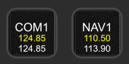
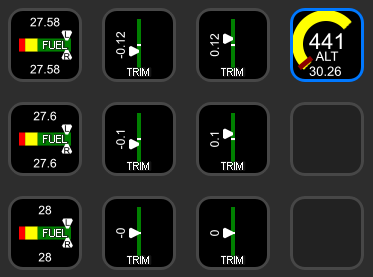

## User Guide for Flight Tracker Stream Deck Plugin

### Installation

1. Download latest version from https://github.com/nguyenquyhy/Flight-Tracker-StreamDeck/releases
1. Double click the file `tech.flighttracker.streamdeck.streamDeckPlugin` to install
   - If you manually created the folder `tech.flighttracker.streamdeck.sdPlugin` previously in `%appdata%\Elgato\StreamDeck\Plugins`, there will be an error saying "This custom action is already installed." although you won't see it in More Actions list. In this case you will need to manually remove that folder before trying again.
1. Accept the prompt to install the plugin and the profiles. The profile is a special numpad, allowing you to enter COM/NAV frequency.
1. You should now see Flight Tracker group in your list of buttons.

### Usage

#### Notes

At the moment, there are 2 groups of buttons:

| Group | Pro | Con |
|-------|-----|-----|
| **Generic** | Potentially work with any SimConnect variables of the correct type | Need to look up the variable's and event's name |
| **Preset** | Specifically designed for certain variables, so setting up is just drag-and-drop and select its function Has special functionality such as holding COM/NAV button to open numpad | Require development effort to add more buttons with similar functionality |

We will maintain and improve both groups to facilitate the widest audience with different levels of experience in flight simming.

#### Buttons

##### Generic Toggle Button

This is the most powerful button in the plugin. It can trigger a SimConnect event, or show a SimConnect variable or both at the same time.

However, with great power comes great responsibility: you have to do a bit of setting up for the parameters.

| Parameter | Description | Example |
|-----------|-------------|---------|
| Title | This is the built-in title of any Stream Deck button. We hide this by default. You should consider using the next parameter instead. | *Empty* |
| Header | This is similar to title but with a pre-defined font, size and position that looks nice on the button. | HDG |
| Toggle event | The SimConnect event that triggers when the button is tapped on. You can find the supporting event ID in [FlightStreamDeckCore/Structs.cs](/FlightStreamDeck.Core/Structs.cs). Explaination of each ID can be found in [Prepar3D SDK - Event IDs](http://www.prepar3d.com/SDKv2/LearningCenter/utilities/variables/event_ids.html) or MSFS SDK docs. | KEY_AP_PANEL_HEADING_HOLD |
| Toggle parameter | The parameter to pass along with the event | 1 |
| Feedback value | The SimConnect variable that indicates if the button is *active* or not. Active state will show a green light or a green number (if `Display value` below is set) on the button. You can find the supporting variables in [FlightStreamDeckCore/Structs.cs](/FlightStreamDeck.Core/Structs.cs). Explaination for each variable can be found in [Prepar3D SDK - Simulation Variables](http://www.prepar3d.com/SDKv2/LearningCenter/utilities/variables/simulation_variables.html) or MSFS SDK docs. You can also use some comparison operators such as "==", "!=", ">", "<", ">=", "<=" between a variable and a value or between 2 variables. | AUTOPILOT HEADING LOCK FLAPS HANDLE INDEX==2 |
| Display value | The SimConnect variable (any numeric unit) to display as a number below the header. You can find the supporting variables in [FlightStreamDeckCore/Structs.cs](/FlightStreamDeck.Core/Structs.cs). Explaination for each variable can be found in [Prepar3D SDK - Simulation Variables](http://www.prepar3d.com/SDKv2/LearningCenter/utilities/variables/simulation_variables.html) or MSFS SDK docs.  | AUTOPILOT HEADING LOCK DIR |

This button allows you to choose custom button images for active and inactive states. 
The image should be of size 72x72 pixel (or 144x144 for higher res decks) and should be in PNG format.

##### Preset Toggle Button

This button toggles some preset functions without much setting up.

| Function Parameter | Display | Tap | Hold |
|--------------------|---------|-----|------|
| Avionics Master | Avionics Master status | Toggle Avionics Master | |
| AP Master | AP Master status | Toggle AP Master | |
| AP Heading | AP Heading status & value | Toggle AP Heading | Sync current heading |
| AP Nav | AP Nav status | Toggle AP Nav | |
| AP Altitude | AP Altitude status | Toggle AP Altitude | |
| AP V/S | AP V/S status | Toggle AP V/S| |
| AP Approach | AP Approach status | Toggle AP Approach | |

This button allows you to choose custom button images for active and inactive states. 
The image should be of size 72x72 pixel (or 144x144 for higher res decks) and should be in PNG format.

##### Preset Increase/Decrease Button

This button allows you to increase/decrease certain values in the sim.

| Function Parameter | Tap | Hold |
|--------------------|-----|------|
| AP Heading | Increase/Decrease by 1 | Increase/Decrease by 10
| AP Altitude | Increase/Decrease by 100 | Increase/Decrease by 1000
| AP V/S | Increase/Decrease by 100 | Increase/Decrease by 100

##### NAV & COM

This button shows active & standby frequency, allows you to swap standby frequency and enter the frequency with a numpad.

Interactions:
- Tap: Swap frequencies
- Hold: Show numpad to enter frequency. 
  - This switches your Stream Deck to a Numpad profile that is bundled with the plugin. If the profile is not installed yet, Stream Deck will ask you to install the profile when the plugin is installed or when you hold this button.
  - This does not work on the Stream Deck Mini due to the limited number of buttons.

##### Generic Gauge

This button is very similar to Generic Toggle Button except from it does not have an active state, hence no `Feedback value` parameter is needed.

- `Minimal value` and `Maximum value` are compulsory, indicating the range of the `Display value`.
- Having a `Minimal value` greater than the `Maximum value` will flip the way the value resolves on the graph (see two trim gauges above).
- You may enter `Use Absolute Value for Value Text` on a `custom` type gauge, which will display the value without a negative if one would show up (right column trim gauges, for example).
- The gauge may be cusom color coded, and knows basic colors from [system.drawing.colors](https://docs.microsoft.com/en-us/dotnet/api/system.drawing.color?view=net-5.0#properties).
  - The default custom gauge that displays is color coded like the fuel gauge and has all the properties in it for a generic 2 tank aircraft.
- You can adjust the thickness of the bar by adjusting `Chart Thickness` in the custom 
section.
- You can adjust the chevron size by adjusting `Chart Chevron Size` in the custom section.
- If you do not specify a header for a value in the top or bottom, it won't show that respective value or chevron.  If you want a blank chevron, simply put a blank space in, it will recognize that.
- There is now a concept of a `Sub Display value`.  In my example for Indicated Altitude, the inches of MG displayed by adding `KOHLSMAN_SETTING_HG` to that setting.

### Known Issues

- At the moment, the customm images are stored as absolute path to the image files, so it is not very user friendly for exporting and importing to another PC. We are working on image embedding feature for future updates.
- If you spam the same buttons too quickly, SimConnect will get error and stop responding to any further command. The plugin will try to automatically reconnect. 
  - However, if you see the message "Connected to Flight Simulator" flashing constantly in the sim, the plugin might be in a infinitely retry loop. In this case, close Stream Deck software on your PC (which will kill the plugin), wait a couple of seconds for all the SimConnect connections to close, and re-open Stream Deck.
- When you setup new generic buttons or COM/NAV button, the registration between the plugin and SimConnect might get messed up and the plugin stops receiving data. In this case, you'll need to restart Stream Deck software.
